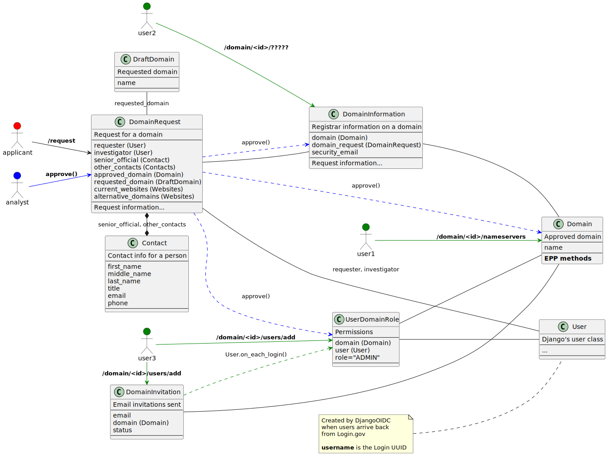
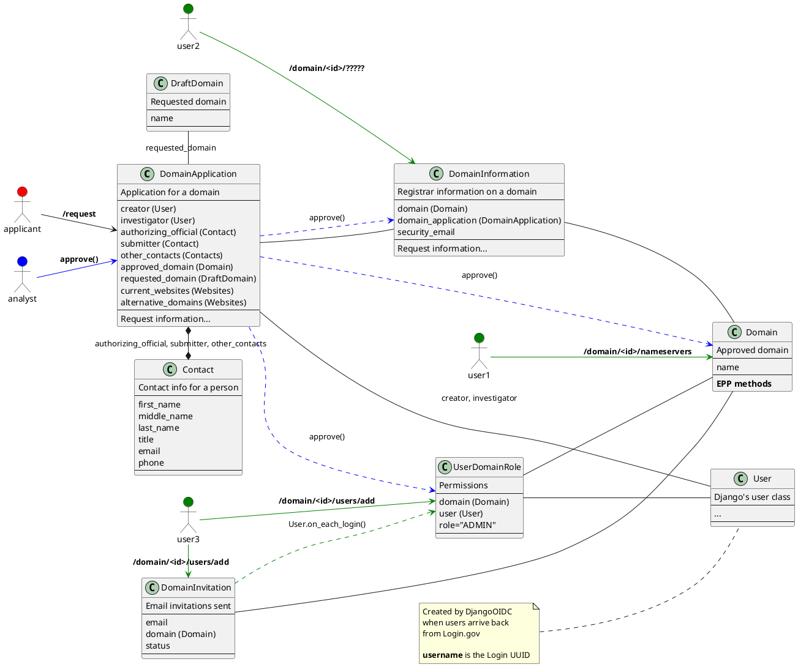

# Data Model Timeline

This diagram connects the data models along with various workflow stages.

1. The applicant starts the process at `/request` interacting with the
   `DomainApplication` object.

2. The analyst approves the application using the `DomainApplication`'s
   `approve()` method which creates many related objects: `UserDomainRole`,
   `Domain`, and `DomainInformation`.

3. After the domain is approved, users interact with various
   `/domain/<id>/...` views which make changes to the `Domain`,
   `DomainInformation`, and `UserDomainRole` models. For inviting new users,
   there is a `DomainInvitation` model that allows people to be added to
   domains who are not already users.

A more complete diagram of the data models, their fields, and their
relationships are in [models_diagram.md](./models_diagram.md), created with
the `django-model2puml` plugin.



<details>
<summary>PlantUML source code</summary>
To regenerate this image using Docker, run

```bash
$ docker run -v $(pwd):$(pwd) -w $(pwd) -it plantuml/plantuml -tsvg model_timeline.md
```




</details>
