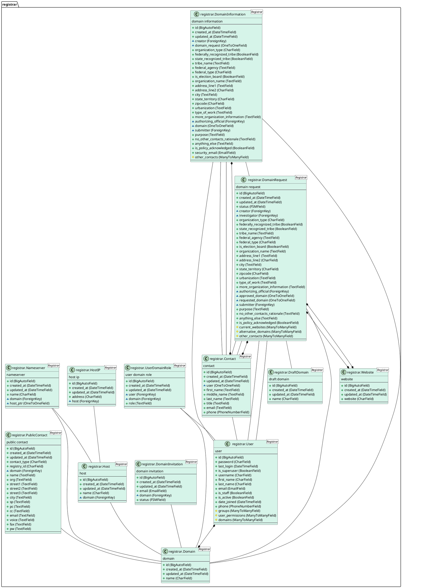

# Complete model documentation

This is an auto-generated diagram of our data models generated with the
[django-model2puml](https://github.com/sen-den/django-model2puml) library
using the command

```bash
$ docker compose exec app ./manage.py generate_puml --include registrar
```
Note: You must uncomment `puml_generator` from  `INSTALLED_APPS` in settings.py and docker-compose down and up before running the above command


<details>
<summary>PlantUML source code</summary>

To regenerate this image using Docker, run

```bash
$ docker run -v $(pwd):$(pwd) -w $(pwd) -it plantuml/plantuml -tsvg models_diagram.md
```



</details>
