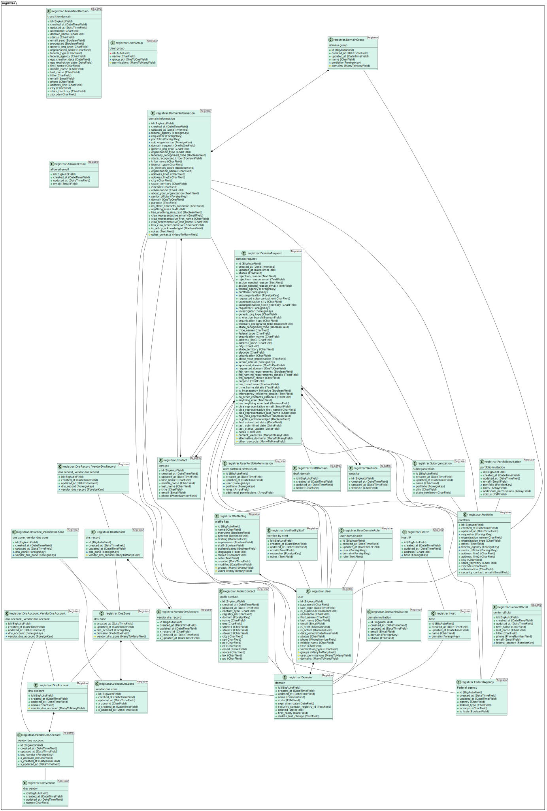

# Complete model documentation

This is an auto-generated diagram of our data models generated with the
[django-model2puml](https://github.com/sen-den/django-model2puml) library.

## How to generate the puml

1. Uncomment `puml_generator` from  `INSTALLED_APPS` in settings.py and docker-compose down and up
2. Run the following command to generate a puml file

```bash
docker compose exec app ./manage.py generate_puml --include registrar
```



<details>
<summary>PlantUML source code</summary>

## How To regenerate the database svg image

1. Copy your puml file contents into the bottom of this file and replace the current code marked by `plantuml`
2. Navigate to the `diagrams` folder and then run the following command below:

```bash
docker run -v $(pwd):$(pwd) -w $(pwd) -it plantuml/plantuml -tsvg models_diagram.md
```

3. Remove the puml file from earlier (if you still have it)
4. Commit the new image and the md file


```plantuml
@startuml
class "registrar.Contact <Registrar>" as registrar.Contact #d6f4e9 {
    contact
    --
    + id (BigAutoField)
    + created_at (DateTimeField)
    + updated_at (DateTimeField)
    + first_name (CharField)
    + middle_name (CharField)
    + last_name (CharField)
    + title (CharField)
    + email (EmailField)
    + phone (PhoneNumberField)
    --
}


class "registrar.UserDomainRole <Registrar>" as registrar.UserDomainRole #d6f4e9 {
    user domain role
    --
    + id (BigAutoField)
    + created_at (DateTimeField)
    + updated_at (DateTimeField)
    ~ user (ForeignKey)
    ~ domain (ForeignKey)
    + role (TextField)
    --
}
registrar.UserDomainRole -- registrar.User
registrar.UserDomainRole -- registrar.Domain


class "registrar.DomainInvitation <Registrar>" as registrar.DomainInvitation #d6f4e9 {
    domain invitation
    --
    + id (BigAutoField)
    + created_at (DateTimeField)
    + updated_at (DateTimeField)
    + email (EmailField)
    ~ domain (ForeignKey)
    + status (FSMField)
    --
}
registrar.DomainInvitation -- registrar.Domain


class "registrar.Host <Registrar>" as registrar.Host #d6f4e9 {
    host
    --
    + id (BigAutoField)
    + created_at (DateTimeField)
    + updated_at (DateTimeField)
    + name (CharField)
    ~ domain (ForeignKey)
    --
}
registrar.Host -- registrar.Domain


class "registrar.HostIP <Registrar>" as registrar.HostIP #d6f4e9 {
    Host IP
    --
    + id (BigAutoField)
    + created_at (DateTimeField)
    + updated_at (DateTimeField)
    + address (CharField)
    ~ host (ForeignKey)
    --
}
registrar.HostIP -- registrar.Host


class "registrar.PublicContact <Registrar>" as registrar.PublicContact #d6f4e9 {
    public contact
    --
    + id (BigAutoField)
    + created_at (DateTimeField)
    + updated_at (DateTimeField)
    + contact_type (CharField)
    + registry_id (CharField)
    ~ domain (ForeignKey)
    + name (CharField)
    + org (CharField)
    + street1 (CharField)
    + street2 (CharField)
    + street3 (CharField)
    + city (CharField)
    + sp (CharField)
    + pc (CharField)
    + cc (CharField)
    + email (EmailField)
    + voice (CharField)
    + fax (CharField)
    + pw (CharField)
    --
}
registrar.PublicContact -- registrar.Domain


class "registrar.Domain <Registrar>" as registrar.Domain #d6f4e9 {
    domain
    --
    + id (BigAutoField)
    + created_at (DateTimeField)
    + updated_at (DateTimeField)
    + name (DomainField)
    + state (FSMField)
    + expiration_date (DateField)
    + security_contact_registry_id (TextField)
    + deleted (DateField)
    + first_ready (DateField)
    + dsdata_last_change (TextField)
    --
}


class "registrar.FederalAgency <Registrar>" as registrar.FederalAgency #d6f4e9 {
    Federal agency
    --
    + id (BigAutoField)
    + created_at (DateTimeField)
    + updated_at (DateTimeField)
    + agency (CharField)
    + federal_type (CharField)
    + acronym (CharField)
    + is_fceb (BooleanField)
    --
}


class "registrar.DomainRequest <Registrar>" as registrar.DomainRequest #d6f4e9 {
    domain request
    --
    + id (BigAutoField)
    + created_at (DateTimeField)
    + updated_at (DateTimeField)
    + status (FSMField)
    + rejection_reason (TextField)
    + rejection_reason_email (TextField)
    + action_needed_reason (TextField)
    + action_needed_reason_email (TextField)
    ~ federal_agency (ForeignKey)
    ~ portfolio (ForeignKey)
    ~ sub_organization (ForeignKey)
    + requested_suborganization (CharField)
    + suborganization_city (CharField)
    + suborganization_state_territory (CharField)
    ~ requester (ForeignKey)
    ~ investigator (ForeignKey)
    + generic_org_type (CharField)
    + is_election_board (BooleanField)
    + organization_type (CharField)
    + federally_recognized_tribe (BooleanField)
    + state_recognized_tribe (BooleanField)
    + tribe_name (CharField)
    + federal_type (CharField)
    + organization_name (CharField)
    + address_line1 (CharField)
    + address_line2 (CharField)
    + city (CharField)
    + state_territory (CharField)
    + zipcode (CharField)
    + urbanization (CharField)
    + about_your_organization (TextField)
    ~ senior_official (ForeignKey)
    ~ approved_domain (OneToOneField)
    ~ requested_domain (OneToOneField)
    + feb_naming_requirements (BooleanField)
    + feb_naming_requirements_details (TextField)
    + feb_purpose_choice (CharField)
    + purpose (TextField)
    + has_timeframe (BooleanField)
    + time_frame_details (TextField)
    + is_interagency_initiative (BooleanField)
    + interagency_initiative_details (TextField)
    + no_other_contacts_rationale (TextField)
    + anything_else (TextField)
    + has_anything_else_text (BooleanField)
    + cisa_representative_email (EmailField)
    + cisa_representative_first_name (CharField)
    + cisa_representative_last_name (CharField)
    + has_cisa_representative (BooleanField)
    + is_policy_acknowledged (BooleanField)
    + first_submitted_date (DateField)
    + last_submitted_date (DateField)
    + last_status_update (DateField)
    + notes (TextField)
    # current_websites (ManyToManyField)
    # alternative_domains (ManyToManyField)
    # other_contacts (ManyToManyField)
    --
}
registrar.DomainRequest -- registrar.FederalAgency
registrar.DomainRequest -- registrar.Portfolio
registrar.DomainRequest -- registrar.Suborganization
registrar.DomainRequest -- registrar.User
registrar.DomainRequest -- registrar.User
registrar.DomainRequest -- registrar.Contact
registrar.DomainRequest -- registrar.Domain
registrar.DomainRequest -- registrar.DraftDomain
registrar.DomainRequest *--* registrar.Website
registrar.DomainRequest *--* registrar.Website
registrar.DomainRequest *--* registrar.Contact


class "registrar.DomainInformation <Registrar>" as registrar.DomainInformation #d6f4e9 {
    domain information
    --
    + id (BigAutoField)
    + created_at (DateTimeField)
    + updated_at (DateTimeField)
    ~ federal_agency (ForeignKey)
    ~ requester (ForeignKey)
    ~ portfolio (ForeignKey)
    ~ sub_organization (ForeignKey)
    ~ domain_request (OneToOneField)
    + generic_org_type (CharField)
    + organization_type (CharField)
    + federally_recognized_tribe (BooleanField)
    + state_recognized_tribe (BooleanField)
    + tribe_name (CharField)
    + federal_type (CharField)
    + is_election_board (BooleanField)
    + organization_name (CharField)
    + address_line1 (CharField)
    + address_line2 (CharField)
    + city (CharField)
    + state_territory (CharField)
    + zipcode (CharField)
    + urbanization (CharField)
    + about_your_organization (TextField)
    ~ senior_official (ForeignKey)
    ~ domain (OneToOneField)
    + purpose (TextField)
    + no_other_contacts_rationale (TextField)
    + anything_else (TextField)
    + has_anything_else_text (BooleanField)
    + cisa_representative_email (EmailField)
    + cisa_representative_first_name (CharField)
    + cisa_representative_last_name (CharField)
    + has_cisa_representative (BooleanField)
    + is_policy_acknowledged (BooleanField)
    + notes (TextField)
    # other_contacts (ManyToManyField)
    --
}
registrar.DomainInformation -- registrar.FederalAgency
registrar.DomainInformation -- registrar.User
registrar.DomainInformation -- registrar.Portfolio
registrar.DomainInformation -- registrar.Suborganization
registrar.DomainInformation -- registrar.DomainRequest
registrar.DomainInformation -- registrar.Contact
registrar.DomainInformation -- registrar.Domain
registrar.DomainInformation *--* registrar.Contact


class "registrar.DraftDomain <Registrar>" as registrar.DraftDomain #d6f4e9 {
    draft domain
    --
    + id (BigAutoField)
    + created_at (DateTimeField)
    + updated_at (DateTimeField)
    + name (CharField)
    --
}


class "registrar.DnsAccount <Registrar>" as registrar.DnsAccount #d6f4e9 {
    dns account
    --
    + id (BigAutoField)
    + created_at (DateTimeField)
    + updated_at (DateTimeField)
    + name (CharField)
    # vendor_dns_account (ManyToManyField)
    --
}
registrar.DnsAccount *--* registrar.VendorDnsAccount


class "registrar.DnsVendor <Registrar>" as registrar.DnsVendor #d6f4e9 {
    dns vendor
    --
    + id (BigAutoField)
    + created_at (DateTimeField)
    + updated_at (DateTimeField)
    + name (CharField)
    --
}


class "registrar.VendorDnsAccount <Registrar>" as registrar.VendorDnsAccount #d6f4e9 {
    vendor dns account
    --
    + id (BigAutoField)
    + created_at (DateTimeField)
    + updated_at (DateTimeField)
    ~ dns_vendor (ForeignKey)
    + x_account_id (CharField)
    + x_created_at (DateTimeField)
    + x_updated_at (DateTimeField)
    --
}
registrar.VendorDnsAccount -- registrar.DnsVendor


class "registrar.DnsAccount_VendorDnsAccount <Registrar>" as registrar.DnsAccount_VendorDnsAccount #d6f4e9 {
    dns account_ vendor dns account
    --
    + id (BigAutoField)
    + created_at (DateTimeField)
    + updated_at (DateTimeField)
    ~ dns_account (ForeignKey)
    ~ vendor_dns_account (ForeignKey)
    --
}
registrar.DnsAccount_VendorDnsAccount -- registrar.DnsAccount
registrar.DnsAccount_VendorDnsAccount -- registrar.VendorDnsAccount


class "registrar.DnsZone <Registrar>" as registrar.DnsZone #d6f4e9 {
    dns zone
    --
    + created_at (DateTimeField)
    + updated_at (DateTimeField)
    ~ dns_account (ForeignKey)
    ~ domain (OneToOneField)
    # vendor_dns_zone (ManyToManyField)
    --
}
registrar.DnsZone -- registrar.DnsAccount
registrar.DnsZone -- registrar.Domain
registrar.DnsZone *--* registrar.VendorDnsZone


class "registrar.VendorDnsZone <Registrar>" as registrar.VendorDnsZone #d6f4e9 {
    vendor dns zone
    --
    + id (BigAutoField)
    + created_at (DateTimeField)
    + updated_at (DateTimeField)
    + x_zone_id (CharField)
    + x_created_at (DateTimeField)
    + x_updated_at (DateTimeField)
    --
}


class "registrar.DnsZone_VendorDnsZone <Registrar>" as registrar.DnsZone_VendorDnsZone #d6f4e9 {
    dns zone_ vendor dns zone
    --
    + id (BigAutoField)
    + created_at (DateTimeField)
    + updated_at (DateTimeField)
    ~ dns_zone (ForeignKey)
    ~ vendor_dns_zone (ForeignKey)
    --
}
registrar.DnsZone_VendorDnsZone -- registrar.DnsZone
registrar.DnsZone_VendorDnsZone -- registrar.VendorDnsZone


class "registrar.DnsRecord <Registrar>" as registrar.DnsRecord #d6f4e9 {
    dns record
    --
    + id (BigAutoField)
    + created_at (DateTimeField)
    + updated_at (DateTimeField)
    ~ dns_zone (ForeignKey)
    # vendor_dns_record (ManyToManyField)
    --
}
registrar.DnsRecord -- registrar.DnsZone
registrar.DnsRecord *--* registrar.VendorDnsRecord


class "registrar.VendorDnsRecord <Registrar>" as registrar.VendorDnsRecord #d6f4e9 {
    vendor dns record
    --
    + id (BigAutoField)
    + created_at (DateTimeField)
    + updated_at (DateTimeField)
    + x_record_id (CharField)
    + x_created_at (DateTimeField)
    + x_updated_at (DateTimeField)
    --
}


class "registrar.DnsRecord_VendorDnsRecord <Registrar>" as registrar.DnsRecord_VendorDnsRecord #d6f4e9 {
    dns record_ vendor dns record
    --
    + id (BigAutoField)
    + created_at (DateTimeField)
    + updated_at (DateTimeField)
    ~ dns_record (ForeignKey)
    ~ vendor_dns_record (ForeignKey)
    --
}
registrar.DnsRecord_VendorDnsRecord -- registrar.DnsRecord
registrar.DnsRecord_VendorDnsRecord -- registrar.VendorDnsRecord


class "registrar.UserPortfolioPermission <Registrar>" as registrar.UserPortfolioPermission #d6f4e9 {
    user portfolio permission
    --
    + id (BigAutoField)
    + created_at (DateTimeField)
    + updated_at (DateTimeField)
    ~ user (ForeignKey)
    ~ portfolio (ForeignKey)
    + roles (ArrayField)
    + additional_permissions (ArrayField)
    --
}
registrar.UserPortfolioPermission -- registrar.User
registrar.UserPortfolioPermission -- registrar.Portfolio


class "registrar.PortfolioInvitation <Registrar>" as registrar.PortfolioInvitation #d6f4e9 {
    portfolio invitation
    --
    + id (BigAutoField)
    + created_at (DateTimeField)
    + updated_at (DateTimeField)
    + email (EmailField)
    ~ portfolio (ForeignKey)
    + roles (ArrayField)
    + additional_permissions (ArrayField)
    + status (FSMField)
    --
}
registrar.PortfolioInvitation -- registrar.Portfolio


class "registrar.TransitionDomain <Registrar>" as registrar.TransitionDomain #d6f4e9 {
    transition domain
    --
    + id (BigAutoField)
    + created_at (DateTimeField)
    + updated_at (DateTimeField)
    + username (CharField)
    + domain_name (CharField)
    + status (CharField)
    + email_sent (BooleanField)
    + processed (BooleanField)
    + generic_org_type (CharField)
    + organization_name (CharField)
    + federal_type (CharField)
    + federal_agency (CharField)
    + epp_creation_date (DateField)
    + epp_expiration_date (DateField)
    + first_name (CharField)
    + middle_name (CharField)
    + last_name (CharField)
    + title (CharField)
    + email (EmailField)
    + phone (CharField)
    + address_line (CharField)
    + city (CharField)
    + state_territory (CharField)
    + zipcode (CharField)
    --
}


class "registrar.VerifiedByStaff <Registrar>" as registrar.VerifiedByStaff #d6f4e9 {
    verified by staff
    --
    + id (BigAutoField)
    + created_at (DateTimeField)
    + updated_at (DateTimeField)
    + email (EmailField)
    ~ requestor (ForeignKey)
    + notes (TextField)
    --
}
registrar.VerifiedByStaff -- registrar.User


class "registrar.User <Registrar>" as registrar.User #d6f4e9 {
    user
    --
    + id (BigAutoField)
    + password (CharField)
    + last_login (DateTimeField)
    + is_superuser (BooleanField)
    + username (CharField)
    + first_name (CharField)
    + last_name (CharField)
    + email (EmailField)
    + is_staff (BooleanField)
    + is_active (BooleanField)
    + date_joined (DateTimeField)
    + status (CharField)
    + phone (PhoneNumberField)
    + middle_name (CharField)
    + title (CharField)
    + verification_type (CharField)
    # groups (ManyToManyField)
    # user_permissions (ManyToManyField)
    # domains (ManyToManyField)
    --
}
registrar.User *--* registrar.Domain


class "registrar.UserGroup <Registrar>" as registrar.UserGroup #d6f4e9 {
    User group
    --
    - id (AutoField)
    + name (CharField)
    ~ group_ptr (OneToOneField)
    # permissions (ManyToManyField)
    --
}


class "registrar.Website <Registrar>" as registrar.Website #d6f4e9 {
    website
    --
    + id (BigAutoField)
    + created_at (DateTimeField)
    + updated_at (DateTimeField)
    + website (CharField)
    --
}


class "registrar.WaffleFlag <Registrar>" as registrar.WaffleFlag #d6f4e9 {
    waffle flag
    --
    + id (BigAutoField)
    + name (CharField)
    + everyone (BooleanField)
    + percent (DecimalField)
    + testing (BooleanField)
    + superusers (BooleanField)
    + staff (BooleanField)
    + authenticated (BooleanField)
    + languages (TextField)
    + rollout (BooleanField)
    + note (TextField)
    + created (DateTimeField)
    + modified (DateTimeField)
    # groups (ManyToManyField)
    # users (ManyToManyField)
    --
}
registrar.WaffleFlag *--* registrar.User


class "registrar.Portfolio <Registrar>" as registrar.Portfolio #d6f4e9 {
    portfolio
    --
    + id (BigAutoField)
    + created_at (DateTimeField)
    + updated_at (DateTimeField)
    ~ requester (ForeignKey)
    + organization_name (CharField)
    + organization_type (CharField)
    + notes (TextField)
    ~ federal_agency (ForeignKey)
    ~ senior_official (ForeignKey)
    + address_line1 (CharField)
    + address_line2 (CharField)
    + city (CharField)
    + state_territory (CharField)
    + zipcode (CharField)
    + urbanization (CharField)
    + security_contact_email (EmailField)
    --
}
registrar.Portfolio -- registrar.User
registrar.Portfolio -- registrar.FederalAgency
registrar.Portfolio -- registrar.SeniorOfficial


class "registrar.DomainGroup <Registrar>" as registrar.DomainGroup #d6f4e9 {
    domain group
    --
    + id (BigAutoField)
    + created_at (DateTimeField)
    + updated_at (DateTimeField)
    + name (CharField)
    ~ portfolio (ForeignKey)
    # domains (ManyToManyField)
    --
}
registrar.DomainGroup -- registrar.Portfolio
registrar.DomainGroup *--* registrar.DomainInformation


class "registrar.Suborganization <Registrar>" as registrar.Suborganization #d6f4e9 {
    suborganization
    --
    + id (BigAutoField)
    + created_at (DateTimeField)
    + updated_at (DateTimeField)
    + name (CharField)
    ~ portfolio (ForeignKey)
    + city (CharField)
    + state_territory (CharField)
    --
}
registrar.Suborganization -- registrar.Portfolio


class "registrar.SeniorOfficial <Registrar>" as registrar.SeniorOfficial #d6f4e9 {
    senior official
    --
    + id (BigAutoField)
    + created_at (DateTimeField)
    + updated_at (DateTimeField)
    + first_name (CharField)
    + last_name (CharField)
    + title (CharField)
    + phone (PhoneNumberField)
    + email (EmailField)
    ~ federal_agency (ForeignKey)
    --
}
registrar.SeniorOfficial -- registrar.FederalAgency


class "registrar.AllowedEmail <Registrar>" as registrar.AllowedEmail #d6f4e9 {
    allowed email
    --
    + id (BigAutoField)
    + created_at (DateTimeField)
    + updated_at (DateTimeField)
    + email (EmailField)
    --
}


@enduml
